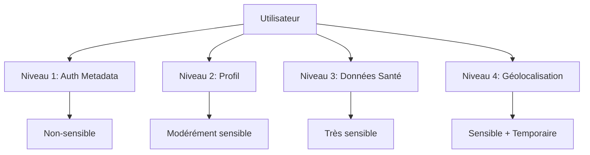

# 🏃‍♂️ Running App - Application de Course Simple

Une application Vue 3 moderne pour le suivi de course avec authentification Supabase simple et efficace.

## ✨ Fonctionnalités

### 🔐 Authentification Simple
- Inscription/Connexion avec email + mot de passe
- Nom d'utilisateur personnalisable
- Confirmation par email (Supabase)
- Gestion sécurisée des sessions

### 👤 Profil Utilisateur Basique
- Email (depuis l'authentification)
- Nom d'utilisateur modifiable
- Interface simple et claire

### 🎨 Interface Moderne
- Design responsive avec Tailwind CSS
- Formulaires simples et intuitifs
- Messages d'erreur clairs
- Navigation fluide

## 🚀 Démarrage Rapide

### Prérequis
- Node.js 18+
- npm ou yarn
- Compte Supabase

### Installation

```bash
# Cloner le projet
git clone <repository-url>
cd running_app

# Installer les dépendances
npm install

# Configurer l'environnement
cp .env.example .env
# Éditer .env avec vos clés Supabase
```

### Configuration Supabase

1. **Créer un projet Supabase**
   - Aller sur [supabase.com](https://supabase.com)
   - Créer un nouveau projet
   - Noter l'URL et la clé anonyme

2. **Pas de configuration BDD nécessaire !**
   - Supabase gère automatiquement l'authentification
   - Pas besoin de créer de tables pour commencer
   - Les métadonnées utilisateur sont stockées automatiquement

3. **Variables d'environnement**
   ```env
   VITE_SUPABASE_URL=https://your-project.supabase.co
   VITE_SUPABASE_ANON_KEY=your-anon-key
   ```

### Lancement

```bash
# Mode développement
npm run dev

# Build de production
npm run build

# Prévisualisation du build
npm run preview
```

## 🏗️ Architecture

### Stack Technique
- **Frontend**: Vue 3 + Composition API + `<script setup>`
- **Build**: Vite
- **Styling**: Tailwind CSS v4
- **State**: Pinia
- **Router**: Vue Router 4
- **Backend**: Supabase (PostgreSQL + Auth + RLS)

### Séparation des Données



### Stores Pinia

```javascript
// Authentification
const authStore = useAuthStore()
await authStore.signUp(email, password, profileData)

// Profil utilisateur
const profileStore = useProfileStore()
await profileStore.upsertProfile(userId, data)

// Données de santé
const secureStore = useSecureProfileStore()
await secureStore.updateSensitiveData(userId, healthData)

// Géolocalisation
const locationStore = useLocationStore()
await locationStore.getCurrentPosition()
```

## 🔒 Sécurité

### Politiques de Sécurité (RLS)
- **Row Level Security** activé sur toutes les tables
- Accès limité à `auth.uid() = user_id`
- Validation côté serveur avec contraintes SQL
- Audit trail pour les données sensibles

### Validation des Données
```javascript
// Validation automatique dans les stores
const validation = secureStore.validateHealthData({
  weight: 70.5,
  height: 175,
  birth_date: '1990-01-01'
})

if (!validation.valid) {
  console.error(validation.error)
}
```

### Chiffrement
- Connexions HTTPS obligatoires
- Données ultra-sensibles chiffrées côté client
- Clés de session sécurisées
- Expiration automatique des tokens

## 🧩 Utilisation

### Inscription d'un Utilisateur

```vue
<template>
  <CompleteProfileSetup 
    @setup-complete="handleSetupComplete"
    @cancel="handleCancel"
  />
</template>

<script setup>
import CompleteProfileSetup from '@/components/profile/CompleteProfileSetup.vue'

function handleSetupComplete(data) {
  console.log('Configuration terminée:', data)
  router.push('/dashboard')
}
</script>
```

### Accès aux Données Utilisateur

```javascript
import { useAuthStore, useProfileStore, useSecureProfileStore } from '@/stores'

// Informations de base
const authStore = useAuthStore()
console.log(`Utilisateur: ${authStore.userFullName}`)

// Profil complet
const profileStore = useProfileStore()
await profileStore.fetchProfile(authStore.user.id)
console.log(`Unités: ${profileStore.preferredUnits}`)

// Données de santé (si autorisées)
const secureStore = useSecureProfileStore()
await secureStore.fetchSensitiveData(authStore.user.id)
console.log(`IMC: ${secureStore.bmi}`)
```

### Géolocalisation

```javascript
import { useLocationStore } from '@/stores/location'

const locationStore = useLocationStore()

// Obtenir la position
const result = await locationStore.getCurrentPosition()
if (result.success) {
  console.log('Position:', result.location)
}

// Suivi en temps réel
await locationStore.startLocationTracking((location) => {
  console.log('Nouvelle position:', location)
})
```

## 🧪 Tests

```bash
# Tests unitaires
npm run test

# Tests avec couverture
npm run test:coverage

# Tests en mode watch
npm run test:watch
```

### Exemple de Test

```javascript
import { useProfileStore } from '@/stores/profile'

describe('ProfileStore', () => {
  it('should create profile successfully', async () => {
    const store = useProfileStore()
    const result = await store.upsertProfile('user-id', {
      first_name: 'John',
      last_name: 'Doe'
    })
    
    expect(result.success).toBe(true)
    expect(store.isProfileComplete).toBe(true)
  })
})
```

## 📱 Interface Utilisateur

### Configuration Guidée
1. **Informations de base**: Nom, préférences, objectifs
2. **Données de santé**: Poids, taille, âge (optionnel)
3. **Géolocalisation**: Permissions GPS (optionnel)
4. **Récapitulatif**: Validation finale

### Responsive Design
- Mobile-first avec Tailwind CSS
- Breakpoints: sm (640px), md (768px), lg (1024px)
- Navigation adaptative
- Formulaires optimisés tactile

## 📚 Documentation

### Guides Disponibles
- [`guide/SECURE_DATABASE_SETUP.md`](guide/SECURE_DATABASE_SETUP.md) - Configuration BDD
- [`guide/ARCHITECTURE_GUIDE.md`](guide/ARCHITECTURE_GUIDE.md) - Architecture détaillée
- [`guide/DEVELOPER_GUIDE.md`](guide/DEVELOPER_GUIDE.md) - Guide développeur

### Structure des Composants
```
src/components/
├── profile/
│   ├── CompleteProfileSetup.vue    # Orchestrateur principal
│   ├── BasicProfileForm.vue        # Formulaire de base
│   ├── HealthDataForm.vue          # Données de santé
│   └── ProfileSummary.vue          # Récapitulatif
├── location/
│   └── LocationPermissionCard.vue  # Géolocalisation
└── ui/
    └── ...                         # Composants UI
```

## 🚀 Déploiement

### Build de Production
```bash
npm run build
```

### Variables d'Environnement
```env
# Production
VITE_SUPABASE_URL=https://your-production.supabase.co
VITE_SUPABASE_ANON_KEY=your-production-anon-key
```

### Checklist
- [ ] Tests passent
- [ ] Build sans erreurs
- [ ] Variables d'environnement configurées
- [ ] Base de données migrée
- [ ] Politiques RLS activées

## 🤝 Contribution

### Standards de Code
- Vue 3 + Composition API obligatoire
- `<script setup>` pour tous les composants
- Tailwind CSS pour le styling
- Tests unitaires pour les stores critiques

### Workflow
1. Fork du projet
2. Créer une branche feature
3. Développer avec tests
4. Pull request avec description détaillée

## 📄 Licence

MIT License - Voir le fichier [LICENSE](LICENSE) pour plus de détails.

## 🆘 Support

### Issues Communes

**Erreur de connexion Supabase**
```javascript
// Vérifier les variables d'environnement
console.log('URL:', import.meta.env.VITE_SUPABASE_URL)
console.log('Key:', import.meta.env.VITE_SUPABASE_ANON_KEY)
```

**Problème de géolocalisation**
```javascript
// Vérifier les permissions
const permission = await navigator.permissions.query({name: 'geolocation'})
console.log('Permission:', permission.state)
```

**Données non sauvegardées**
```javascript
// Vérifier l'authentification
if (!authStore.isAuthenticated) {
  console.error('Utilisateur non connecté')
}
```

### Contact
- GitHub Issues pour les bugs
- Discussions pour les questions
- Email: [contact@example.com](mailto:contact@example.com)

---

**⚠️ Important**: Cette application gère des données de santé. Respectez toujours les réglementations RGPD et les bonnes pratiques de sécurité.